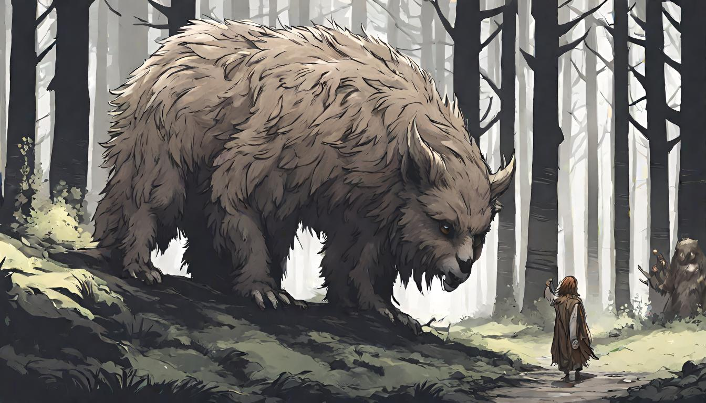

# Saudações, Viajante da Natureza! 🌿🍃

Seja bem-vindo à minha clareira digital no GitHub! Sou um druida do código, conectando-me com a essência da tecnologia e da natureza.

## Sobre Mim 🌳

🌲 Seguidor dedicado dos ensinamentos ancestrais dos druidas, trago a sabedoria da floresta para o mundo digital.
🦉 Explorando os mistérios da programação e os segredos da inteligência artificial com o espírito da natureza como meu guia.
🌱 Comprometido em preservar o equilíbrio entre o mundo digital e o mundo natural.

## Minhas Habilidades 🌟

### Linguagens de Marcação e Programação:

  
  
  
  
  
  

### Banco de Dados e Ferramentas:

  
  
  
  
  
  
  
  
  

## Entre em Contato 🌄

  
  
   
  
   

## Estatísticas GitHub 📊

  
  
  

Que os espíritos da floresta guiem nossos códigos e que nossas jornadas sejam tão profundas quanto as raízes das árvores antigas! 🌲🌌
